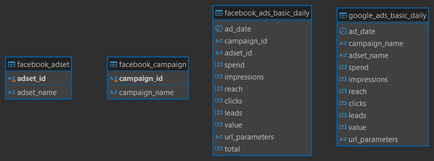
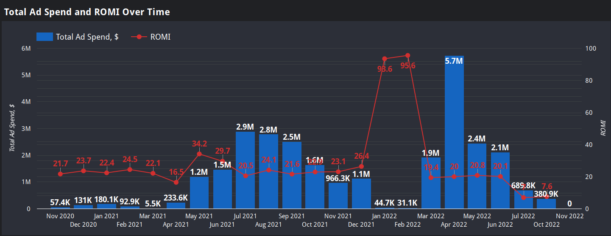
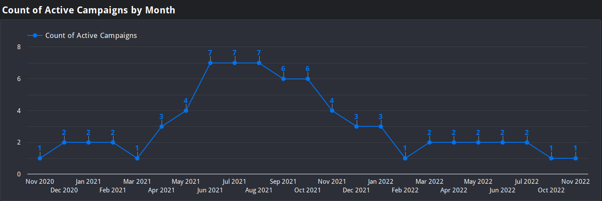
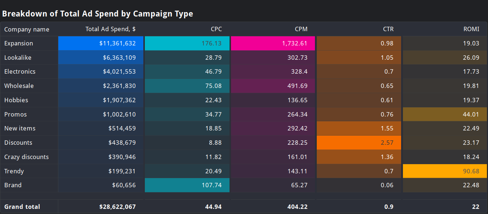

# Ad Campaign Analysis with SQL and Looker Studio

## Introduction
This repository contains SQL scripts and Google Looker Studio dashboards designed to analyze the performance of advertising campaigns on both Google Ads and Facebook Ads. The goal of this project is to provide insights into campaign effectiveness, identify areas for improvement, and inform future marketing decisions.

## Data Sources
The data for this project was extracted from a PostgreSQL database containing four primary tables:
* **Facebook Ads:** `facebook_ads_basic_daily`, `facebook_adset`, `facebook_campaign`
* **Google Ads:** `google_ads_basic_daily`
  

## Tools
DBeaver, Looker Studio

## SQL Queries

### Query 1. Facebook Campaign Metrics Daily

~~~SQL
SELECT
	f.ad_date,
	f.campaign_id,
	sum (f.spend) AS spend,
	sum (f.impressions) AS impressions,
	sum (f.clicks) AS clicks,
	sum (f.value) AS value,
	sum (f.spend) / sum (f.clicks) AS cpc,
	round((sum(f.spend) ::NUMERIC / sum(f.impressions)) * 1000,
	2) AS cpm,
	round((sum(f.clicks) ::NUMERIC / sum(f.impressions)) * 100,
	2) AS ctr,
	round((((sum(f.value) - sum(f.spend)) ::NUMERIC / sum(f.spend))) * 100,
	2) AS romi
FROM
	facebook_ads_basic_daily f
WHERE 
	f.campaign_id IS NOT NULL
	AND f.clicks > 0
	AND f.impressions > 0
	AND f.spend > 0
	AND f.impressions > 0
GROUP BY 
	f.ad_date,
	f.campaign_id
ORDER BY
	f.ad_date DESC;
 ~~~

This SQL query analyzes Facebook ad performance data from the `facebook_ads_basic_daily` table. It calculates key metrics for each day and campaign:

1. **Total Spend:** The total amount spent on ads.
2. **Total Impressions:** The total number of times ads were shown.
3. **Total Clicks:** The total number of clicks on ads.
4. **Total Value:** The total value generated by the ads.
5. **CPC (Cost Per Click):** The average cost per click.
6. **CPM (Cost Per Mille):** The cost per 1000 impressions.
7. **CTR (Click-Through Rate):** The percentage of impressions that resulted in clicks.
8. **ROMI (Return on Marketing Investment):** The return on investment for the ads, expressed as a percentage.

The query filters out records with zero clicks, impressions, or spend to avoid division by zero errors. It then groups the results by date and campaign ID and sorts them by date in descending order.

### Query 2. Daily Ad Performance by Platform 

~~~SQL
WITH combined_ads AS (
SELECT
        ad_date,
	'Facebook Ads' AS media_source,
	spend,
	impressions,
	reach,
	clicks,
	leads,
	value
FROM
	facebook_ads_basic_daily f
WHERE
        ad_date IS NOT NULL
UNION ALL
SELECT
	ad_date,
	'Google Ads' AS media_source,
	spend,
	impressions,
	reach,
	clicks,
	leads,
	value
FROM
	google_ads_basic_daily g
WHERE
	ad_date IS NOT NULL
)
SELECT
	ad_date,
	media_source,
	sum (spend) / sum (clicks) AS CPC,
	round((sum(spend)::NUMERIC / sum(impressions)) * 1000,
	2) AS CPM,
	round((sum(clicks)::NUMERIC / sum(impressions)) * 100,
	2) AS CTR,
	round((((sum(value) - sum(spend))::NUMERIC / sum(spend))) * 100,
	2) AS ROMI
FROM
	combined_ads
WHERE
	reach > 0
	AND leads > 0
	AND clicks > 0
	AND impressions > 0
	AND spend > 0
	AND impressions > 0
GROUP BY
	ad_date,
	media_source
ORDER BY
	ad_date,
	media_source DESC;
~~~

This SQL query combines data from Facebook Ads and Google Ads into a single dataset, calculates key performance metrics, and filters out irrelevant data.

**Here's a breakdown:**

1. **Data Combination:**
   - It merges data from `facebook_ads_basic_daily` and `google_ads_basic_daily` tables into a single Common Table Expression (CTE) named `combined_ads`.
   - It adds a `media_source` column to differentiate between the two platforms.

2. **Metric Calculation:**
   - It calculates the following metrics for each date and media source:
     - **CPC (Cost Per Click):** Average cost per click.
     - **CPM (Cost Per Mille):** Cost per 1000 impressions.
     - **CTR (Click-Through Rate):** Percentage of impressions that resulted in clicks.
     - **ROMI (Return on Marketing Investment):** Percentage return on investment.

3. **Data Filtering:**
   - It filters the data to exclude records with zero values for `reach`, `leads`, `clicks`, `impressions`, and `spend` to avoid division by zero errors.

4. **Grouping and Sorting:**
   - It groups the results by `ad_date` and `media_source`.
   - It sorts the results by `ad_date` in descending order and then by `media_source` in descending order.
  
### Query 3. Combined Ad Set Daily Performance

~~~SQL
WITH combi_data AS (
SELECT
	fbd.ad_date,
	'Facebook Ads' AS media_source,
	fc.campaign_name,
	fa.adset_name,
	fbd.spend,
	fbd.impressions,
	fbd.reach,
	fbd.clicks,
	fbd.leads,
	fbd.value
FROM
	facebook_ads_basic_daily fbd
LEFT JOIN facebook_adset fa ON
	fbd.adset_id = fa.adset_id
LEFT JOIN facebook_campaign fc ON
	fbd.campaign_id = fc.campaign_id
WHERE
        fbd.ad_date IS NOT NULL
UNION ALL
SELECT
	g.ad_date,
	'Google Ads' AS media_source,
	g.campaign_name,
	g.adset_name,
	g.spend,
	g.impressions,
	g.reach,
	g.clicks,
	g.leads,
	g.value
FROM
	google_ads_basic_daily g
WHERE
	g.ad_date IS NOT NULL	
)
SELECT
	ad_date,
	media_source,
	campaign_name,
	adset_name,
	sum (spend) AS total_spend,
	sum (impressions) AS total_impressions,
	sum (clicks) AS total_clicks,
	sum (value) AS total_value
FROM
	combi_data
GROUP BY
	ad_date,
	media_source,
	campaign_name,
	adset_name
ORDER BY 
	ad_date DESC;
~~~

This SQL query combines data from Facebook Ads and Google Ads into a single dataset, providing a detailed view of campaign and ad set performance.

**Here's a breakdown:**

1. **Data Combination:**
   - It merges data from `facebook_ads_basic_daily`, `facebook_adset`, and `facebook_campaign` tables for Facebook Ads.
   - It merges data from the `google_ads_basic_daily` table for Google Ads.
   - The resulting dataset includes information about ad date, media source, campaign name, ad set name, spend, impressions, reach, clicks, leads, and value.

2. **Data Aggregation:**
   - It groups the combined data by `ad_date`, `media_source`, `campaign_name`, and `adset_name`.
   - It calculates the total spend, impressions, clicks, and value for each group.

3. **Result Ordering:**
   - It sorts the results by `ad_date` in descending order.

**In essence, this query provides a consolidated view of advertising performance across both platforms, allowing for detailed analysis and comparison of campaigns and ad sets.**

### Query 4. For Google Looker Studio

~~~SQL
WITH combined_ads AS (
SELECT
	ad_date,
	'Facebook Ads' AS media_source,
	spend,
	impressions,
	reach,
	clicks,
	leads,
	value
FROM
	facebook_ads_basic_daily f
WHERE
        ad_date IS NOT NULL
UNION ALL
SELECT
	ad_date,
	'Google Ads' AS media_source,
	spend,
	impressions,
	reach,
	clicks,
	leads,
	value
FROM
	google_ads_basic_daily g
WHERE
	ad_date IS NOT NULL
)
SELECT
	ad_date,
	media_source,
	sum (spend) AS spend,
	sum (impressions) AS impressions,
	sum (clicks) AS clicks,
	sum (value) AS value
FROM
	combined_ads
WHERE
	reach > 0
	AND leads > 0
	AND clicks > 0
	AND impressions > 0
	AND spend > 0
	AND impressions > 0
GROUP BY
	ad_date,
	media_source
ORDER BY
	ad_date,
	media_source DESC;
~~~

This SQL query combines data from Facebook Ads and Google Ads into a single dataset and calculates aggregated metrics for each day and media source. 

**Here's a breakdown:**

1. **Data Combination:**
   - Merges data from `facebook_ads_basic_daily` and `google_ads_basic_daily` tables.
   - Adds a `media_source` column to distinguish between the two platforms.

2. **Data Filtering:**
   - Filters out records with zero values for `reach`, `leads`, `clicks`, `impressions`, and `spend` to avoid division by zero errors.

3. **Metric Calculation:**
   - Calculates the total `spend`, `impressions`, `clicks`, and `value` for each day and media source.

4. **Result Ordering:**
   - Sorts the results by `ad_date` in descending order.

In essence, this query provides a consolidated view of advertising performance across both platforms, allowing for comparison and analysis of overall campaign performance.

Additional calculated fields have been created in Google Looker Studio:
1. Total Ad Spend or Ad Spend
2. CPC (Cost Per Click)
3. CPM (Cost Per Mille or Cost Per Thousand Impressions)
4. CTR (Click-Through Rate)
5. ROMI (Return on Marketing Investment)

Based on the query and calculated fields, three graphs were constructed.

1. **Total Ad Spend and ROMI Over Time**  
   Description: This chart shows the monthly advertising spend and the Return on Marketing Investment (ROMI) from November 2020 to November 2022.

   

2. **Count of Active Campaigns by Month**  
   Description: This chart tracks the number of active advertising campaigns for each month over the same period.

   

4. **Breakdown of Total Ad Spend by Campaign Type**  
   Description: This chart categorizes ad spend by campaign types such as "Expansion," "Lookalike," and others, along with key metrics like CPC, CPM, CTR, and ROMI.

   

   

 
